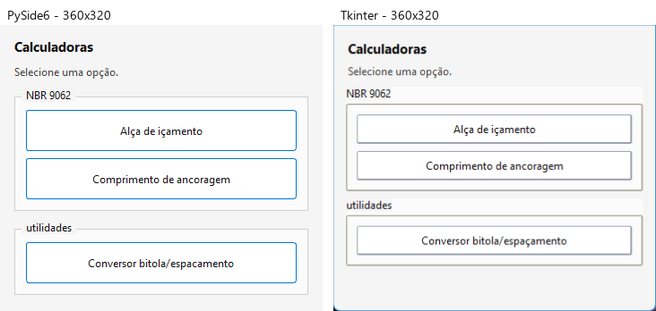
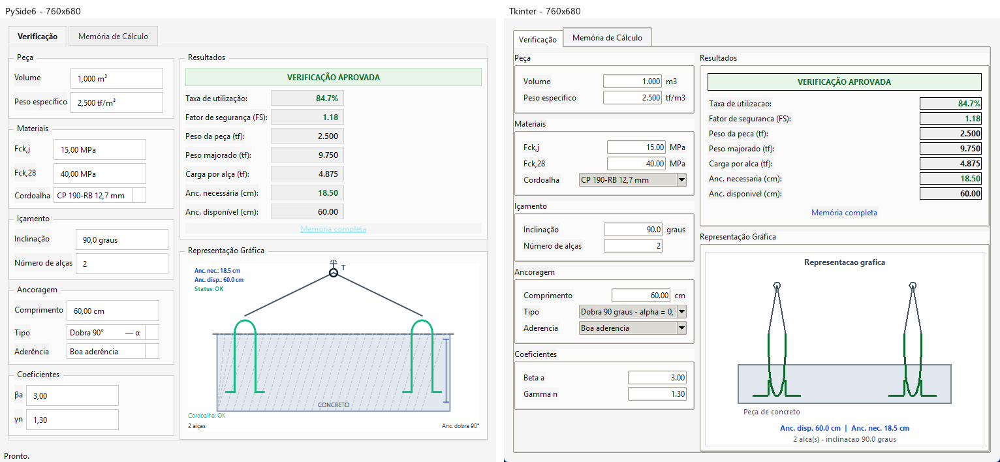
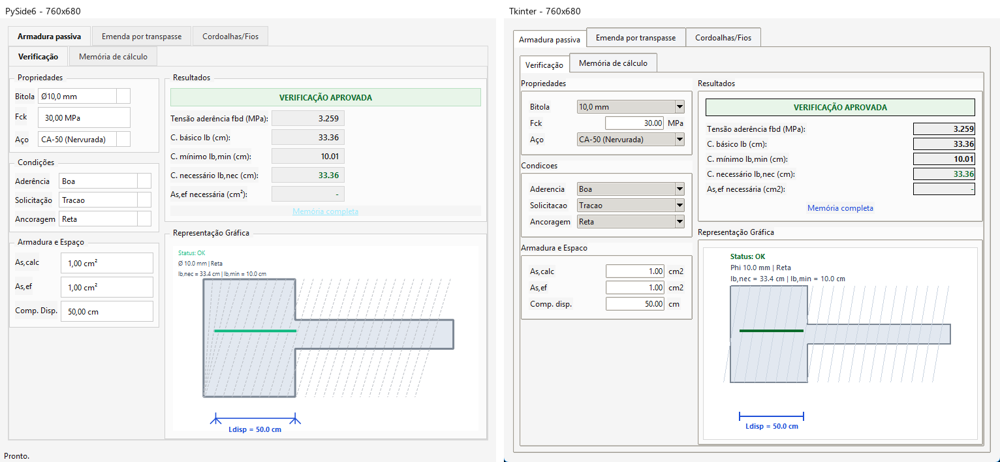
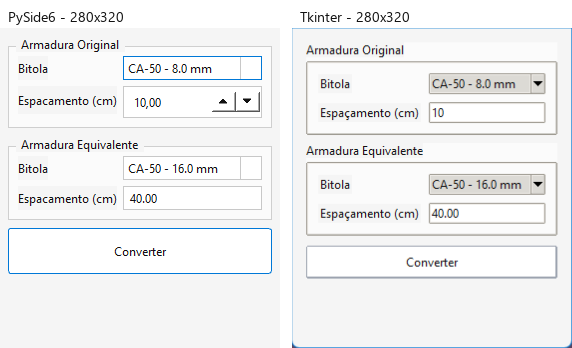

# Comparacao Visual PySide6 x Tkinter

Capturas geradas automaticamente para revisao lado a lado.

## home

## lifting

## anchorage

## rebar_converter

## Observacoes

- Dimensoes-base conferidas: home 360x320, conversor 280x320 e calculadoras 760x680.
- Diferencas esperadas permanecem nos controles nativos Qt/ttk, como combo, botao e spinbox.
- Validar manualmente alinhamentos finos, espacamentos, textos e proporcoes.
- Aprovacao visual final permanece como checkpoint manual do plano.
